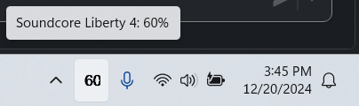

# Description
This script runs on Windows 11 and provides the battery percentage for a Bluetooth device (headset) in a taskbar notification.  

Example of what it looks like in the Taskbar when the mouse hovers over the icon (battery percentage):  

